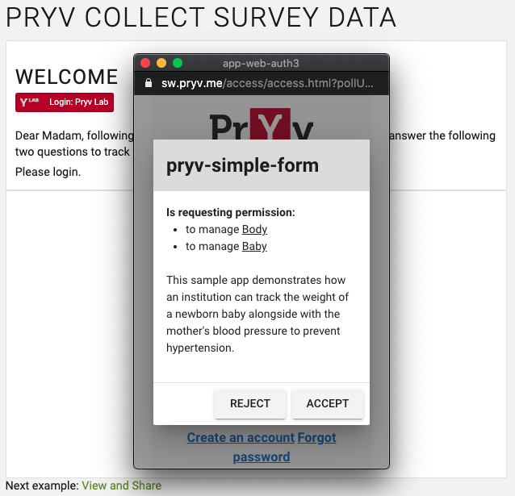
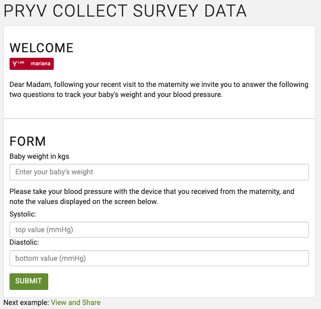

## Pryv collect survey data example 

Web app for creation & collection of answers using a simple form.

## Story

You are creating a simple form to track the mother's blood pressure and the baby's weight after the mother leaves the maternity hospital.
When the mother logs in to her Pryv.io account, she receives an access request from your app on the necessary streams.
Once she gives her consent to the app, she can answer the questions of the form and submit the data. The data is then accessible on her Pryv.io account.

| Sign in                                                 | Consent                                                      | Fill form                                                      |
| ------------------------------------------------------------ | ------------------------------------------------------------ | ------------------------------------------------------------ |
|  |  |  |

## Project Specifications

- Create form UI
- Ask for login
- Request access for the app "pryv-simple-form" to write in the streams "Baby" and "Body"
- Display the form
- Submit answers and store values in the relevant streams

## Data structure

This use case implies the creation of a stream structure and the use of different event types that are explained below.

### Stream structure

The app "pryv-simple-form" first requests an access on the streams "Baby" and "Body" with a "manage" level in order to be able to manage data in these streams children.
The blood pressure of the mother is stored as an event and added to the stream "Heart", while the weight of the baby is added to the stream "Baby-Body".

The following stream structure is created in the variable `apiCall`:

### Event types

The [Event types directory](https://api.pryv.com/event-types/) contains standard event types, and can be customized and completed with your own event types.

In our example, we use the event type `mass/kg` for the baby's weight (see [here](https://api.pryv.com/event-types/#mass) for details) and the event type `blood-pressure/mmhg-bpm` for the blood pressure of the mother (see [here](https://api.pryv.com/event-types/#blood-pressure) for details).
