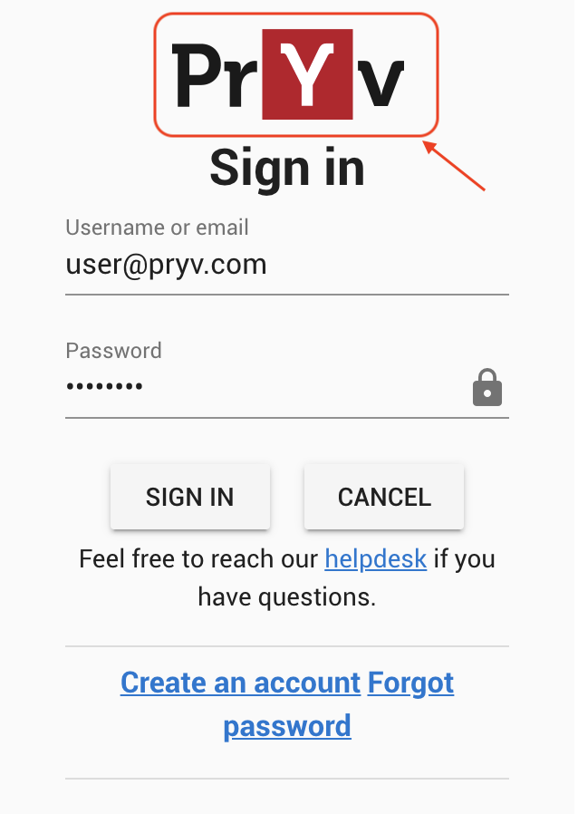

# Customize assets for your Pryv.io web apps

- [Live Demo](https://youtu.be/VI1zjLLcR9Q)
- [Tutorial](tutorial.md)
- [Video](https://youtu.be/VI1zjLLcR9Q) 

This example describes how to edit icons and assets for your Pryv.io web apps. 

It demonstrates how you can modify the logo to adapt it to your own branding.

You can either :
- modify assets directly in the **"public_html/assets/"** folder of your Open Pryv.io as shown in the [video](https://youtu.be/VI1zjLLcR9Q). To test the changes, follow the steps in the [Run Open Pryv.io section](tutorial.md#run-open-pryvio) of the tutorial.

- fork the [Github repository](https://github.com/pryv/assets-open-pryv.io) containing visual assets for the Open Pryv.io platform and customize it. We strongly recommend you to choose this method for a production environment so that you can keep track of your changes. 

Follow the [tutorial](tutorial.md) that explains how to use a fork to edit the assets.

    

### Next steps

You can check out the tutorial to edit assets for your web apps:
- [Customize Assets Tutorial](tutorial.md)
