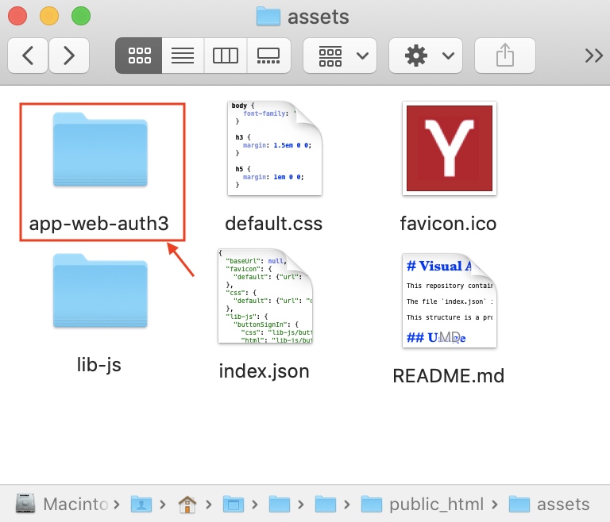
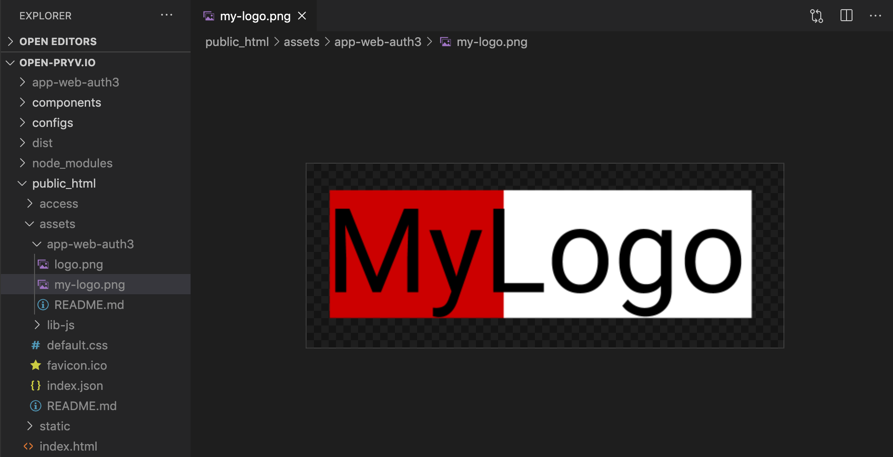
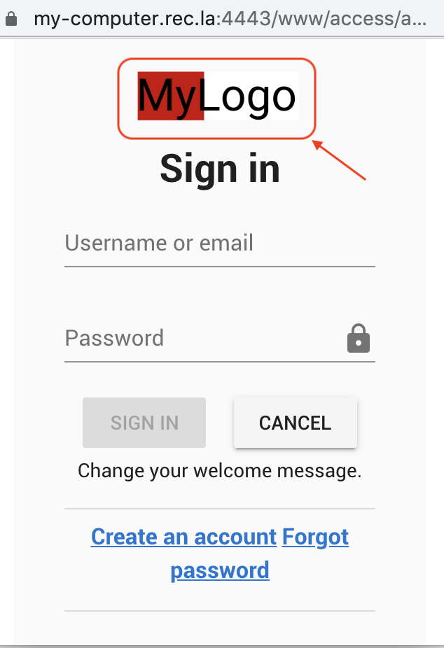

# Customize assets for your Pryv.io web apps

This example describes how to edit icons and assets for your Pryv.io web apps. 

It demonstrates how you can modify the logo to adapt it to your own branding following the different steps of the tutorial video.

You can either :
- modify assets directly in the **"public_html/assets/"** folder of your Open Pryv.io as explained below

- fork the [Github repositery](https://github.com/pryv/assets-open-pryv.io) containing visual assets for the Open Pryv platform and customize it. We strongly recommend you to choose this method for a production environment so that you can benefit from updates of our Javascript library. The procedure is explained in the [tutorial](customize-assets/tutorial.md).


## Locate the assets in your Open Pryv.io

You first need to run your instance of Open Pryv.io on your computer. 

If you haven't installed it yet, you can do so by forking the [Github repositery](https://github.com/pryv/open-pryv.io) of Open Pryv.io and following the instructions in the README.

The code for the assets can be found in the **"public_html/assets/"** folder of your Open Pryv.io. You can directly modify the files from the folder to adapt the style and assets to your own branding.

## Change the logo of your authentication app

To change the logo of the authentication app **app-web-auth3** you should navigate to the **"app-web-auth3"** folder in **"public_html/assets/"**.




You can change the existing logo into your own logo :



In the `index.json` file, modify the URL path to the logo :
```json
"app-web-auth3": {
   	"logo": {
   	  "url": "app-web-auth3/my-logo.png" 
     }
```

You can now test your changes on your Open Pryv.io by opening the authentication page: 
- on [https://api.pryv.com/app-web-access/?pryvServiceInfoUrl=https://my-computer.rec.la/reg/service/info](https://api.pryv.com/app-web-access/?pryvServiceInfoUrl=https://my-computer.rec.la/reg/service/info.) if you are using the Dockerized version
- on [https://api.pryv.com/app-web-access/?pryvServiceInfoUrl=https://my-computer.rec.la:4443/reg/service/info](https://api.pryv.com/app-web-access/?pryvServiceInfoUrl=https://my-computer.rec.la:4443/reg/service/info.) if you are using the Native version

If you are using another public URL, replace `https://my-computer.rec.la` by it in the link above.

After requesting access, you can click on the login button:


This will open the login page on which you can see the applied changes :



### Next steps

You can check out some more template apps that you can customize for your own use:
- [Collecting survey data](collect-survey-data)
