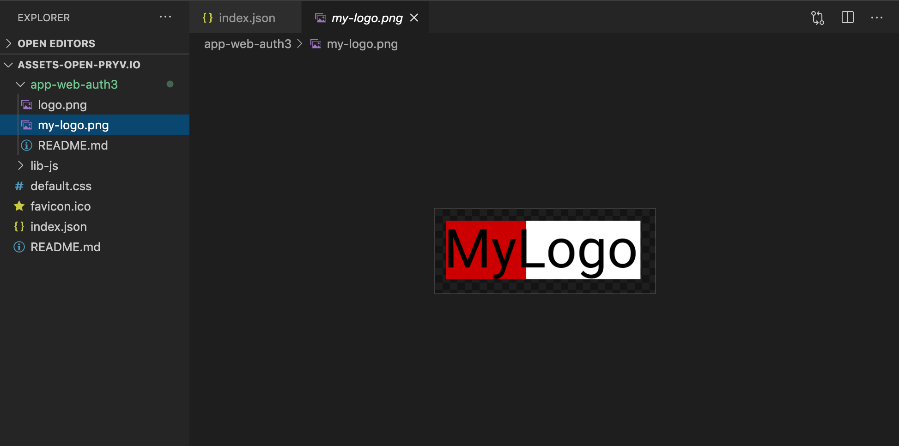
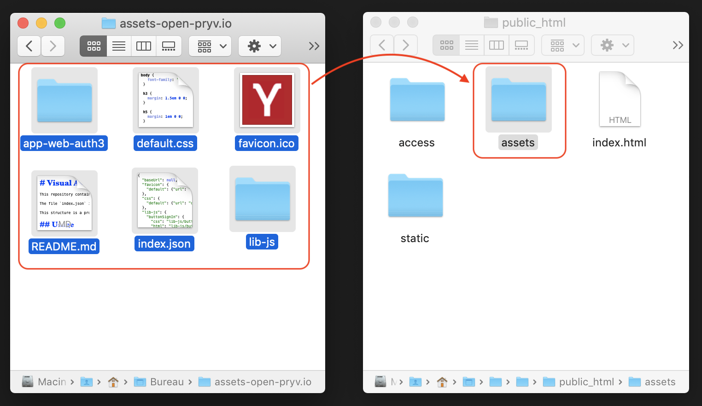
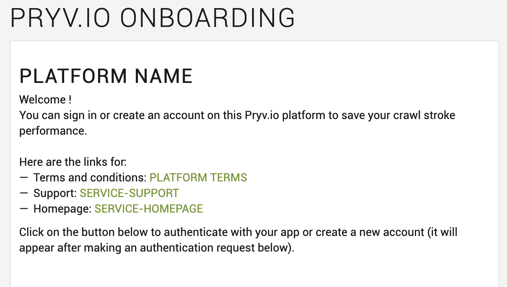
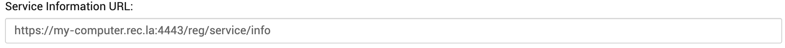

# Customize assets tutorial

In this tutorial we describe the procedure to customize your Pryv.io web apps. As explained in the [README](customize-assets/README.md), it is also possible to directly edit your platform assets in the **public_html/assets** folder of your Open Pryv.io instance.

However, when working in a production environment, we stronly recommend to follow the steps below to change assets for your Open Pryv.io platform.

This will allow you to keep track of your changes and our updates to the [Pryv.io visual assets](https://github.com/pryv/assets-open-pryv.io).


## Fork the Visual Assets repositery 

You can fork the [Github repositery](https://github.com/pryv/assets-open-pryv.io) containing visual assets for the Open Pryv.io platform.

Clone the repositery: `git clone git@github.com:pryv/assets-open-pryv.io.git`.

## Make your changes

See the [README file](https://github.com/pryv/assets-open-pryv.io/blob/master/README.md) to understand the structure of the Visual Assets repositery.

You can for example edit the logo of your authentication app ([app-web-auth3](https://github.com/pryv/app-web-auth3)) and adapt it to your own branding.

To do so, navigate to the folder **app-web-auth3** in **assets-open-pryv.io**.

<p align="center">
    
</p>

Add your own logo "my-logo.png" and update the relevant section in the **index.json** file :

```json
"app-web-auth3": {
   	"logo": {
   	  "url": "app-web-auth3/my-logo.png" 
   	}
  }
```
## Copy to your Open Pryv.io folder

Once your changes are done, copy the content of your **assets-open-pryv.io** folder to **public_html/assets** folder of your Open Pryv.io instance.

<p align="center">
    
</p>

## Run Open Pryv.io

Run your Open Pryv instance from your terminal.

You can test your changes by opening the onboarding example page [https://api.pryv.com/app-web-examples/onboarding/](https://api.pryv.com/app-web-examples/onboarding/).
<p align="center">
    
</p>

In the **Service information** section, select your deployment type and enter the service information URL to fetch service info :
<p align="center">
  
</p>

Once this is done, perform the "Auth request" in the **Authentication request** section.

You can then click on the login button on the top of the page:

<p align="center">

</p>

This will open the login page on which you can see the applied changes :

<p align="center">

</p>


