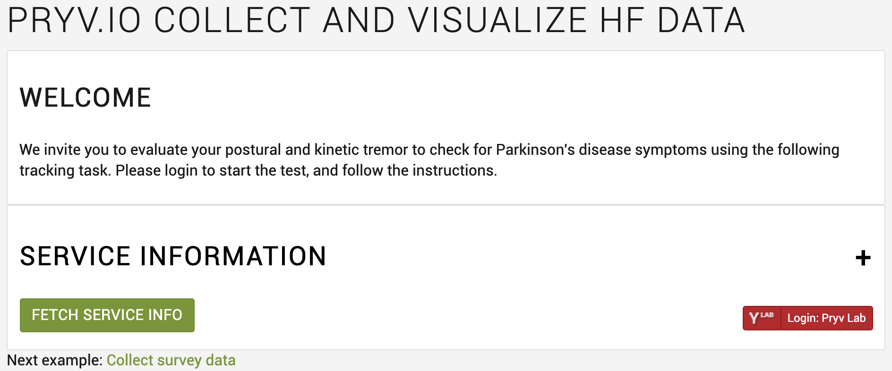
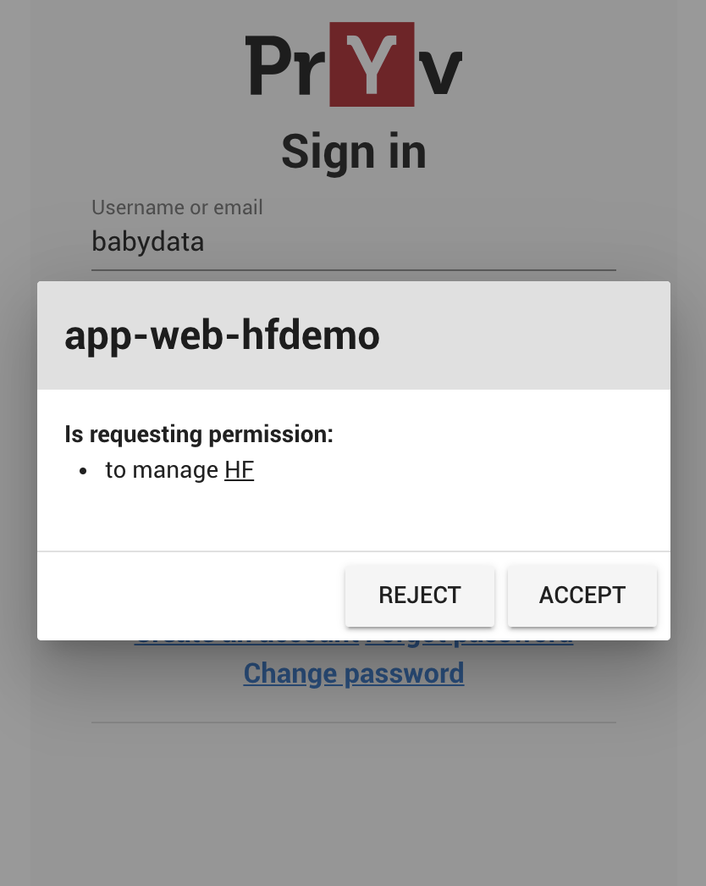
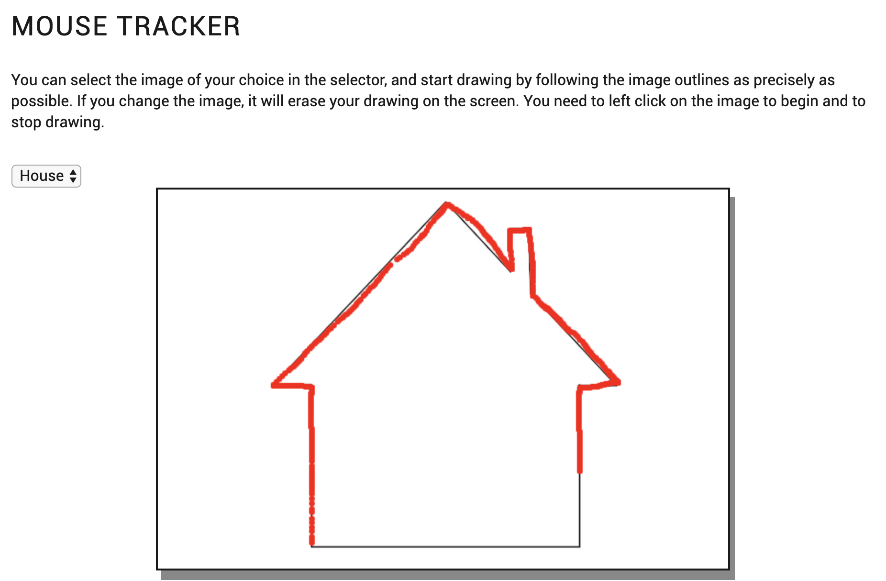
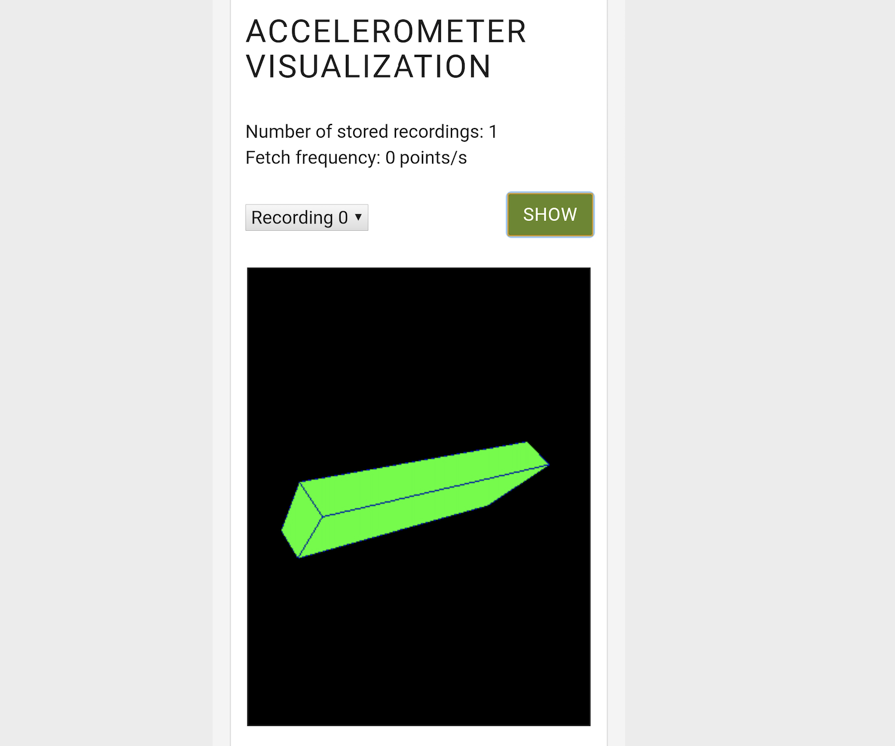
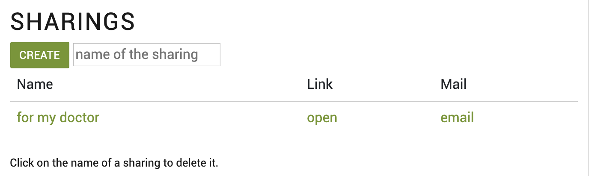
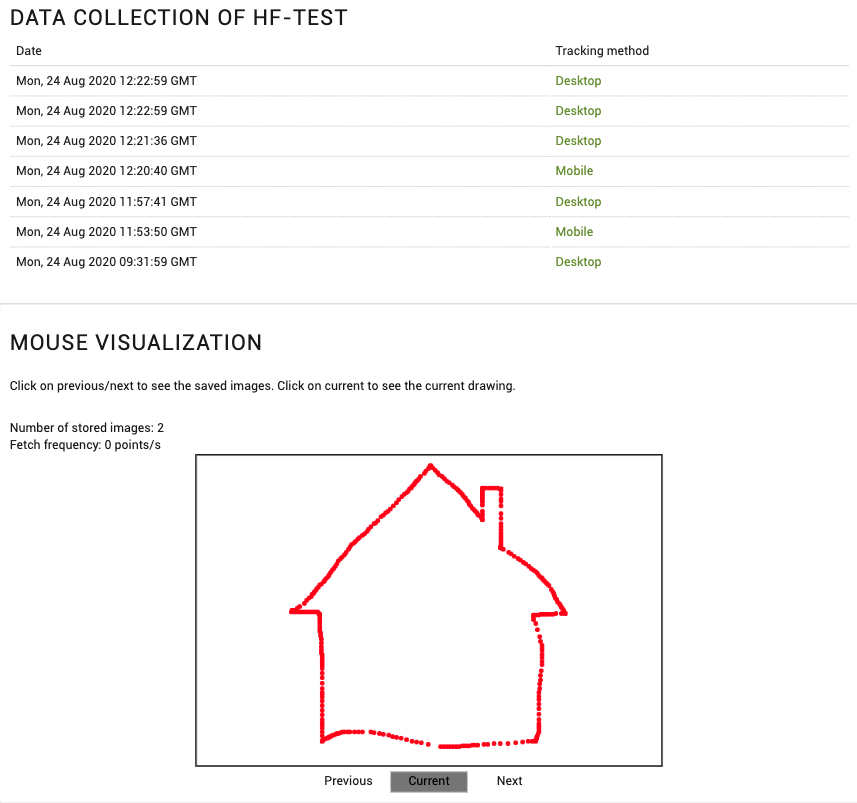
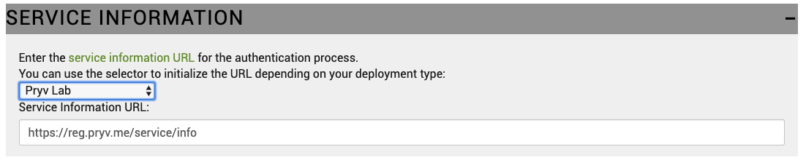

# Pryv Collect and view HF data tutorial

You can try the live version of the app [here](link-to-gh-pages).

All you need to run this app is to download [index.html](index.html), [script.js](script.js) files, [js/](js) and [assets](assets) folders and open **index.html** with your browser.

This is a data collection and sharing web app that first displays a welcome message and a button to initiate the authentication process.
<p align="center">

</p>

With a click on the login button, a popup opens in your browser where you can either authenticate or create a new account. 

When signed in, you can consent to give the app "app-web-hfdemo" permission to manage the stream "**HF**" where the data from the tracker is stored.
<p align="center">

</p>

Once you have accepted, you can start the tracking task using the accelerometer or the mouse.

|Desktop                                                 | Mobile                                                  |
| -------------------------------------------------------|---------------------------------------------------------|
|  |  |

You can visualize your data in the "Visualization" section of the app:

|Desktop                                                 | Mobile                                                  |
| -------------------------------------------------------|---------------------------------------------------------|
|  |  |

You can then share your data by creating a new sharing at the bottom of the page. This will generate a URL link that contains your tracking visualization from the stream "**HF**".

<p align="center">

</p>

The sharing link enables the recipient to consult the list of trackings, along with the tracking method (desktop or mobile), and to click on a tracking to visualize it on the screen:

|Desktop                                                 | Mobile                                                  |
| -------------------------------------------------------|---------------------------------------------------------|
|  |  |


## Authenticate your app

For this application, we have used the [Pryv JavaScript library](https://github.com/pryv/lib-js), loading it for [the browser](https://github.com/pryv/lib-js#browser) as following:

```html
<script src="https://api.pryv.com/lib-js/pryv.js"></script>
```

For authentication, we will use the [Pryv.io consent process](https://github.com/pryv/lib-js#within-a-webpage-with-a-login-button) adding the following element in the HTML:

```html
<span id="pryv-button"></span>
```

The [auth request parameters](https://api.pryv.com/reference/#auth-request) and callback are defined in the separate [script.js](script.js) file:

```javascript
async function authRequest() {
    Pryv.Browser.setupAuth(authSettings, serviceInfoInput.value);
}

const authSettings = {
    spanButtonID: 'pryv-button', 
    onStateChange: pryvAuthStateChange, 
    authRequest: {
        requestingAppId: 'app-web-hfdemo',
        requestedPermissions: [{
            streamId: 'hf',
            defaultName: 'HF',
            level: 'manage' 
        }],
        requestingAppId: 'app-web-hfdemo',
    }
};

async function pryvAuthStateChange(state) {
    console.log('##pryvAuthStateChange', state);
    if (state.id === Pryv.Browser.AuthStates.AUTHORIZED) {
        console.log(state);
        var connection = new Pryv.Connection(state.apiEndpoint);
        await setupStreamStructure(connection);
        updateSharings();
        showCollectAndVisualize(true);
    }
    if (state.id === Pryv.Browser.AuthStates.INITIALIZED) {
        pryvHF.pryvConn = null;
        connection = null;
        showCollectAndVisualize(false);
    }
}
```

The root stream of the `requestedPermissions` array is created if it doesn't exist yet. It will then be populated with events data from the tracking test.

The auth request is done on page load, except when the shared data is loaded by a third-party.

## Collect HF data

Data collected from the mouse movement (desktop version) or device orientation (accelerometer version) will be stored in the form of [HF series](https://api.pryv.com/reference/#data-structure-high-frequency-series) which are collections of homogenous data points in Pryv.io.

```javascript
var pryvHF = {
    pryvConn: null,
    measures: {
        mouseX: {
            event: null,
            buffer: []
        },
        mouseY: {
            event: null,
            buffer: []
        },
        orientationGamma: {
            event: null,
            buffer: []
        },
        orientationBeta: {
            event: null,
            buffer: []
        },
        orientationAlpha: {
            event: null,
            buffer: []
        }
    }

};
```

### Collect HF data using the Desktop version

Once the user is signed in (Desktop version), he can perform the test using the mouse tracker. The code for the mouse tracker is contained in the section "**Build Desktop version**" of the file [script.js](script.js).  

Data collected from the mouse movement (X and Y positions) will be stored in the form of [HF series](https://api.pryv.com/reference/#data-structure-high-frequency-series) in a dedicated stream.  
Connection with Pryv is established to store collected measures in the stream "**HF demo**":
```javascript
async function setupStreamStructure(connection) {
  const resultHandlers = [];
  const apiCalls = [];
  const streams = (await connection.get('streams', null)).streams;
  const [hasRootStream, hasDesktopStream, hasMobileStream] = hasStreams(
    streams
  );
  if (!hasRootStream) {
    apiCalls.push({
      method: 'streams.create',
      params: {
        id: 'hfdemo',
        name: 'HF Demo',
        parentId: 'hf'
      }
    });
    resultHandlers.push(null);
  }
```

[HF events](https://api.pryv.com/reference/#create-hf-event) and their streams need to be created to hold the mouse position, which will be consisting of points along the x and y-axis of type `count/generic` (see [Event Types Reference](https://api.pryv.com/event-types/)):
```javascript
if (!hasDesktopStream) {
      apiCalls.push(
        {
          method: 'streams.create',
          params: {
            id: 'hfdemo-mouse-x',
            name: 'Mouse-X',
            parentId: 'hfdemo',
            clientData: buildPlotlyOptions('Mouse', 'count/generic', 'X')
          }
        },
        {
          method: 'streams.create',
          params: {
            id: 'hfdemo-mouse-y',
            name: 'Mouse-Y',
            parentId: 'hfdemo',
            clientData: buildPlotlyOptions('Mouse', 'count/generic', 'Y')
          }
        }
      );

      resultHandlers.push(null, null, null, null);
    }
    apiCalls.push(
      {
        method: 'events.create',
        params: {
          streamId: 'hfdemo-mouse-x',
          type: 'series:count/generic',
          description: 'Holder for x mouse position'
        }
      },
      {
        method: 'events.create',
        params: {
          streamId: 'hfdemo-mouse-y',
          type: 'series:count/generic',
          description: 'Holder for y mouse position'
        }
      }
    );
    // https://github.com/pryv/lib-js#advanced-usage-of-api-calls-with-optional-individual-result-and-progress-callbacks
    resultHandlers.push(
      function registerEventX(result) {
        pryvHF.measures.mouseX.event = result.event;
        console.log('handle xEvent set', result.event);
      },
      function registerEventY(result) {
        pryvHF.measures.mouseY.event = result.event;
        console.log('handle yEvent set', result.event);
      }
    );
```

These events are populated with the X and Y positions of the mouse:
```javascript
function savePoints() {
  if (pryvHF.pryvConn) {
    sendHfPoints(pryvHF.pryvConn, pryvHF.measures);
  }
  setTimeout(savePoints, SAMPLE_POST_MS);
}

function sendHfPoints(connection, measures) {
  for (let key in measures) {
    let bufferLength = measures[key].buffer.length;
    if (measures[key].event && bufferLength > 0) {
      let points = measures[key].buffer;
      connection.addPointsToHFEvent(
        measures[key].event.id,
        measures[key].event.content.fields,
        points
      );
      measures[key].buffer = [];
    }
  }
}
```

### Collect HF data using the mobile version

The tracking task is also available in a mobile version that allows to collect the device orientation in three dimensions. The code for the accelerometer collector is contained in the section "**Build mobile version**" of the file [script.js](script.js).

Similarly as for the [Desktop version](#collect-hf-data-using-the-desktop-version), data is stored in the dedicated stream "**HF demo**".  

This stream is populated with HF events that will hold data collected from the accelerometer (*alpha*, *beta* and *gamma* orientation angles, thus events of [type](https://api.pryv.com/event-types/) `angle/deg`) of the device:
```javascript
if (!hasMobile) {
  postData.push(
      // Accelerometer
      {
          method: 'streams.create',
          params: {
              id: 'hfdemo-orientation-gamma',
              name: 'Orientation-Gamma',
              parentId: 'hfdemo'
          }
      },
      {
          method: 'streams.update',
          params: {
              id: 'hfdemo-orientation-gamma',
              update: {
                  clientData: buildPlotlyOptions('Orientation', 'angle/deg', 'Gamma')
              }
          }
      },
      {
          method: 'events.create',
          params: {
              streamId: 'hfdemo-orientation-gamma',
              type: 'series:angle/deg',
              description: 'Holder for device gamma'
          }
      },
      {
          method: 'streams.create',
          params: {
              id: 'hfdemo-orientation-beta',
              name: 'Orientation-Beta',
              parentId: 'hfdemo'
          }
      },
      {
          method: 'streams.update',
          params: {
              id: 'hfdemo-orientation-beta',
              update: {
                  clientData: buildPlotlyOptions('Orientation', 'angle/deg', 'Beta')
              }
          }
      },
      {
          method: 'events.create',
          params: {
              streamId: 'hfdemo-orientation-beta',
              type: 'series:angle/deg',
              description: 'Holder for device beta'
          }
      },
      {
          method: 'streams.create',
          params: {
              id: 'hfdemo-orientation-alpha',
              name: 'Orientation-Alpha',
              parentId: 'hfdemo'
          }
      },
      {
          method: 'streams.update',
          params: {
              id: 'hfdemo-orientation-alpha',
              update: {
                  clientData: buildPlotlyOptions('Orientation', 'angle/deg', 'Alpha')
              }
          }
      },
      {
          method: 'events.create',
          params: {
              streamId: 'hfdemo-orientation-alpha',
              type: 'series:angle/deg',
              description: 'Holder for device alpha'
          }
      }
  );
```

Collected data from the accelerometer orientation is then inserted in the previously created HF events:
```javascript
resultTreatment.push(
  null,
  null,
  function handleCreateEventGamma(result) {
      pryvHF.measures.orientationGamma.event = result.event;
      console.log('handle gammaEvent set', result.event);
  },
  null,
  null,
  function handleCreateEventBeta(result) {
      pryvHF.measures.orientationBeta.event = result.event;
      console.log('handle betaEvent set', result.event);
  },
  null,
  null,
  function handleCreateEventAlpha(result) {
      pryvHF.measures.orientationAlpha.event = result.event;
      console.log('handle alphaEvent set', result.event);
  }
);
    } else {
        postData.push(
            {
                method: 'events.create',
                params: {
                    streamId: 'hfdemo-orientation-gamma',
                    type: 'series:angle/deg',
                    description: 'Holder for device gamma'
                }
            },
            {
                method: 'events.create',
                params: {
                    streamId: 'hfdemo-orientation-beta',
                    type: 'series:angle/deg',
                    description: 'Holder for device beta'
                }
            },
            {
                method: 'events.create',
                params: {
                    streamId: 'hfdemo-orientation-alpha',
                    type: 'series:angle/deg',
                    description: 'Holder for device alpha'
                }
            }
        );
resultTreatment.push(
    function handleCreateEventGamma(result) {
        pryvHF.measures.orientationGamma.event = result.event;
        console.log('handle gammaEvent set', result.event);
    },
    function handleCreateEventBeta(result) {
        pryvHF.measures.orientationBeta.event = result.event;
        console.log('handle betaEvent set', result.event);
    },
    function handleCreateEventAlpha(result) {
        pryvHF.measures.orientationAlpha.event = result.event;
        console.log('handle alphaEvent set', result.event);
    }
);
}
```

## Create a sharing

Once data from the tracking task has been collected, the app is designed to allow the user to share his data with a third-party.
The section "**Sharings**" enables the user to create a sharing that consists of a URL link with a Pryv apiEndpoint that displays the visualization from the tracking test. The code for the sharing creation is contained in the section **Sharings** of the file [script.js](script.js).  
In order to create a sharing, we add a listener to the *Create* button:

```javascript
window.onload = (event) => {
  document.getElementById('create-sharing').addEventListener("click", createSharing);
  // ...
}; 
```
The function *createSharing()* translates the sharing into the creation of a [shared access](https://api.pryv.com/concepts/#accesses) in Pryv.io. 
```javascript
async function createSharing() {
    const name = document.getElementById('sharing-name').value.trim();
    if (!name || name === '') {
        alert('Enter a name for your sharing');
        return;
    }
```
It will first fetch values for the scope of the sharing ('streamId' for permissions), in our case "read" level on the stream "**HF Demo**":
```javascript
    const permissions = [{ streamId: 'hfdemo', level: 'read' }];
```

It will package those values into an [accesses.create](https://api.pryv.com/reference/#create-access) API call.
```javascript
  const results = await pryvHF.pryvConn.api([
    // https://github.com/pryv/lib-js#api-calls
    {
      method: 'accesses.create', // creates the selected access: https://api.pryv.com/reference/#create-access
      params: {
        name: name,
        permissions: permissions
      }
    }
  ]);
  const error = results[0].error;
  if (error != null) {
    displayError(error);
    return;
  }
  updateSharings();
```

This call is made using [pryvConn.api()](https://github.com/pryv/lib-js#api-calls) method.

The sharings of the user are also displayed using the function **updateSharings()** that performs an [accesses.get](https://api.pryv.com/reference/#get-accesses) API call:

```javascript
async function updateSharings() {
  const result = await pryvHF.pryvConn.api([
    {
      method: 'accesses.get',
      params: {}
    }
  ]);
  const sharingTable = document.getElementById('sharings-table');
  const accesses = result[0].accesses;
  if (!accesses || accesses.length === 0) {
    return;
  }
  resetTable('sharings-table');
  for (const access of accesses) {
    await addListAccess(sharingTable, access);
  }
}
```

In the same way, the function **deleteSharing()** enables to delete the access selected by the user by performing an [accesses.delete](https://api.pryv.com/reference/#delete-access) API call.

```javascript
async function deleteSharing(accessId) {
    if (!confirm('delete?')) return;
    await pryvHF.pryvConn.api([ 
        {
            method: 'accesses.delete',
            params: { id: accessId }
        }
    ]);
    resetTable('sharings-table')
    updateSharings();
}
```

## Display the sharing (view-only mode)

Once the sharing has been created, it should enable third parties to consult data from the user in a "view-only" mode. In this mode, a table containing all performed tests is displayed, along with the date of the test and the tracking method. For example:
[https://api.pryv.com/app-web-examples/hf-data/?apiEndpoint=https://cke8hrluz00o31kqod5lcdudm@hf-test.pryv.me/](https://api.pryv.com/app-web-examples/hf-data/?apiEndpoint=https://cke8hrluz00o31kqod5lcdudm@hf-test.pryv.me/)  

The recipient of the link can open the data visualization by clicking on the chosen test:
- the **Desktop version** contains the drawing performed with the mouse tracker
- the **Mobile version** displays the recording of the phone orientation

The code for the visualization mode is contained in the [js/view_only.js](js/view_only.js).

This will load the app already authenticated, by passing the `pryvApiEndpoint` parameter in the function *buildVisualizationOnly(apiEndpoint, urlParams)*. 

```javascript
async function buildVisualizationOnly(apiEndpoint, urlParams) {
  document.getElementById('selection-data').style.display = '';
  pryvHF.pryvConn = new Pryv.Connection(apiEndpoint);

  const eventsList = await getEventList();
  populateCollectionTable(eventsList);

  const username = await pryvHF.pryvConn.username();
  document.getElementById('name-selection').innerHTML =
    'Data Collection Of ' + username;

  const eventId_mouseX = urlParams.get('posXEventId');
  const eventId_mouseY = urlParams.get('posYEventId');
```

Either the mobile or the desktop versions are displayed depending on the user's available data:
```javascript
  if (eventId_mouseX && eventId_mouseY) {
    pryvHF.measures.mouseX.event = {
      id: eventId_mouseX
    };
    pryvHF.measures.mouseY.event = {
      id: eventId_mouseY
    };
    buildDesktop();
    document.getElementById('mouse-visualization').style.display = '';
  }

  const eventId_alpha = urlParams.get('angleAEventId');
  const eventId_beta = urlParams.get('angleBEventId');
  const eventId_gamma = urlParams.get('angleYEventId');
  if (eventId_alpha && eventId_beta && eventId_gamma) {
    pryvHF.measures.orientationAlpha.event = {
      id: eventId_alpha
    };
    pryvHF.measures.orientationBeta.event = {
      id: eventId_beta
    };
    pryvHF.measures.orientationGamma.event = {
      id: eventId_gamma
    };
    buildMobile();
    document.getElementById('accelerometer-visualization').style.display = '';
```

## App guidelines

### Custom service info

Following our [app guidelines](https://api.pryv.com/guides/app-guidelines/), we build apps that can work for multiple Pryv.io platforms providing a `serviceInfo` parameter:

```javascript
async function fetchServiceInfo() {
    service = new Pryv.Service(serviceInfoInput.value);
    serviceInfo = await service.info();
    authRequest()
}

async function authRequest() {
    Pryv.Browser.setupAuth(authSettings, serviceInfoInput.value);
}
```
To set a custom Pryv.io platform, provide the service information URL or use the selector to choose your Pryv.io platform in the **Service information** accordion:

<p align="center">

</p>

## Customize the visuals 

You will find the code related to the display of the data in the [index.html](index.html) file. We invite you to customize it with your own message and headings, and adapt the data display according to your needs.