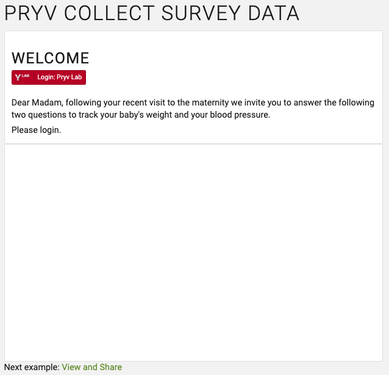

## Pryv collect and view HF data

Web app for high-frequency data collection, visualization & sharing with third parties. The goal of this sample app is to help you get familiar with [high-frequency data](https://api.pryv.com/reference/#hf-series) and how to use it within your apps to collect, display and share HF data.

## Story

You are developing a tracking app to analyse both postural and kinetic tremor for Parkinson's disease diagnosis.    

The desktop version of the app allows to evaluate the kinetic tremor that occurs with voluntary movement, e.g drawing in our case. The mobile version is intended to track patient's arm movement when holding his mobile phone still to test for postural tremor in Parkinson's disease.  
Both results from the task can be combined and presented to the clinician or any competent person in order to evaluate the degree of severity of the symptoms.  

When the patient logs in to his Pryv.io account, he is asked to perform a tracking task:
- **Web version**: Click on to draw the shape of either a heart or a house with the mouse
- **Mobile version**: Keep the phone horizontally with the arm stretched for at least 10 seconds

Results from the tests are saved in the Pryv.io account of the patient, and can be shared through an URL link to a third-party.  

In this web app, you provide the user with a tool to evaluate possible tremor by collecting high frequency data (mouse motion or arm motion) and sharing it with third parties.

| Sign in                                                 | Collect HF data                                                  | Share results                                                      |
| ------------------------------------------------------------ | ------------------------------------------------------------ | ------------------------------------------------------------ |
|  |  |  |

## Project Specifications

- Ask for login
- Request access for the app "app-web-hfdemo" to manage the stream "HF Demo"
- Collect high-frequency data resulting from mouse motion (web version) or phone's accelerometer (mobile version)
- Display the data
- Create or delete a sharing to a third party
- Display shared data 

## Data structure

This use case implies the collection of high-frequency data from either the mouse or the phone's accelerometer. You can find more information about the HF data structure [here](https://api.pryv.com/reference/#hf-series).   

*This feature is available with the [Entreprise license](https://api.pryv.com/concepts/#entreprise-license-open-source-license) only.*

The phone's orientation in three dimensional space according to alpha, beta and gamma angles is collected and stored in HF series for the type `series:angle/deg`.  

The mouse position according to the X and Y axis is collected and stored in HF series for the type `series:count/generic`.

## Data visualization 

Collected HF data from mouse or phone is displayed in real time to the user, along with the previous recordings and the fetch frequency (in points/s):

## Data sharing

Data visualization from both tests can be shared with third-parties. This translates into a 'read' access to the shared stream in which the data from the test is stored. The sharing consists in a link that can be communicated directly or by email to a third party.
When opened, it displays either the drawing from the mouse test or the phone orientation from the desktop test.

## Next steps

You can check out the tutorial to collect and view HF data :

- [Collect HF Data Tutorial](tutorial.md)
