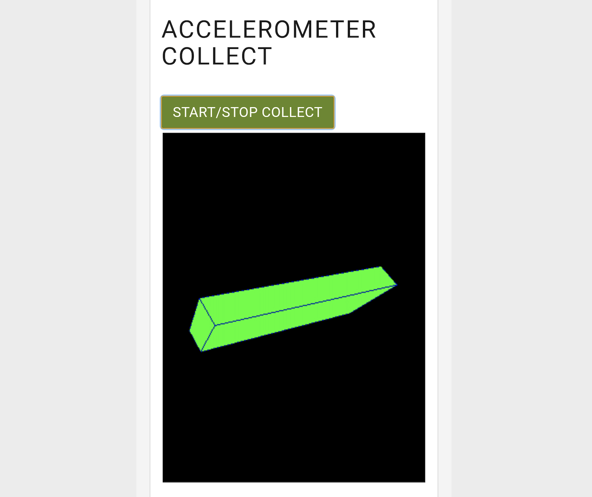
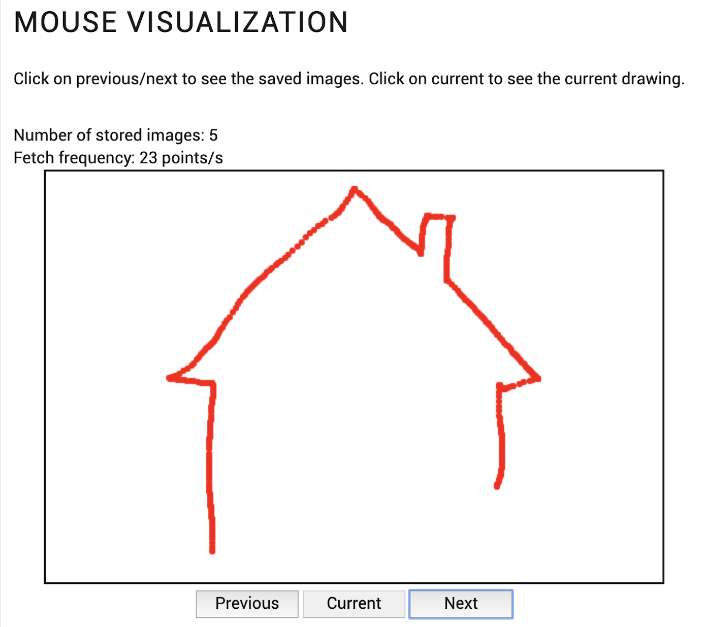

# Pryv Collect and view HF data tutorial

You can try the live version of the app [here](link-to-gh-pages).

All you need to run this app is to download [index.html](index.html) and [script.js](script.js) files and open **index.html** with your browser.

This is a data collection and sharing web app that first displays a welcome message and a button to initiate the authentication process.
<p align="center">

</p>

With a click on the login button, a popup opens in your browser where you can either authenticate or create a new account. 

When signed in, you can consent to give the app "app-web-hfdemo" permission to manage the stream "**HF**" where the data from the tracker is stored.
<p align="center">

</p>

Once you have accepted, you can start the tracking task using the accelerometer or the mouse.

|Desktop                                                 | Mobile                                                  |
| -------------------------------------------------------|---------------------------------------------------------| 
|  |  |

You can visualize your data in the "Visualization" section of the app:

|Desktop                                                 | Mobile                                                  |
| -------------------------------------------------------|---------------------------------------------------------| 
|  |  |

You can then share your data by creating a new sharing at the bottom of the page. This will generate a URL link that contains your tracking visualization from the stream "**HF**".

<p align="center">

</p>

The sharing link enables the recipient to consult the list of trackings, along with the tracking method (desktop or mobile), and to click on a tracking to visualize it on the screen:

|Desktop                                                 | Mobile                                                  |
| -------------------------------------------------------|---------------------------------------------------------| 
|  |  |


## Authenticate your app

For this application, we have used the [Pryv JavaScript library](https://github.com/pryv/lib-js), loading it for [the browser](https://github.com/pryv/lib-js#browser) as following:

```html
<script src="https://api.pryv.com/lib-js/pryv.js"></script>
```

For authentication, we will use the [Pryv.io consent process](https://github.com/pryv/lib-js#within-a-webpage-with-a-login-button) adding the following element in the HTML:

```html
<span id="pryv-button"></span>
```

The [auth request parameters](https://api.pryv.com/reference/#auth-request) and callback are defined in the separate [script.js](script.js) file:

```javascript
async function authRequest() {
    Pryv.Browser.setupAuth(authSettings, serviceInfoInput.value);
}

const authSettings = {
    spanButtonID: 'pryv-button', 
    onStateChange: pryvAuthStateChange, 
    authRequest: {
        requestingAppId: 'app-web-hfdemo',
        requestedPermissions: [{
            streamId: 'hf',
            defaultName: 'HF',
            level: 'manage' 
        }],
        requestingAppId: 'app-web-hfdemo',
    }
};

async function pryvAuthStateChange(state) {
    console.log('##pryvAuthStateChange', state);
    if (state.id === Pryv.Browser.AuthStates.AUTHORIZED) {
        console.log(state);
        var connection = new Pryv.Connection(state.apiEndpoint);
        await setupConnection(connection);
        updateSharings();
        displayDiv(true);
    }
    if (state.id === Pryv.Browser.AuthStates.INITIALIZED) {
        pryvHF.pryvConn = null;
        connection = null;
        displayDiv(false);
    }
}
```

The root stream of the `requestedPermissions` array is created if it doesn't exist yet. It will then be populated with events data from the tracking test.

The auth request is done on page load, except when the shared data is loaded by a third-party.

## Collect HF data

Data collected from the mouse movement (desktop version) or device orientation (accelerometer version) will be stored in the form of [HF series](https://api.pryv.com/reference/#data-structure-high-frequency-series) which are collections of homogenous data points in Pryv.io.

```javascript
var pryvHF = {
    pryvConn: null,
    measures: {
        mouseX: {
            event: null,
            buffer: []
        },
        mouseY: {
            event: null,
            buffer: []
        },
        orientationGamma: {
            event: null,
            buffer: []
        },
        orientationBeta: {
            event: null,
            buffer: []
        },
        orientationAlpha: {
            event: null,
            buffer: []
        }
    }

};

let fromTime = 0;
let samplePostMs = 100;
```

### Collect HF data using the Desktop version

Once the user is signed in (Desktop version), he can perform the test using the mouse tracker. The code for the mouse tracker is contained in the section "**Build Desktop version**" of the file [script.js](script.js).  

Data collected from the mouse movement (X and Y positions) will be stored in the form of [HF series](https://api.pryv.com/reference/#data-structure-high-frequency-series) in a dedicated stream.  
Connection with Pryv is established to store collected data in the stream "**HF demo**":
```javascript
async function setupConnection(connection) {
    var postData;
    var resultTreatment = [];
    var postData = [];
    var streams = (await connection.get('streams', null)).streams;
    let [hasHF, hasDesktop, hasMobile] = isInStreams(streams);
    if (!hasHF) {
        postData.push(
            {
                method: 'streams.create',
                params: {
                    id: 'hfdemo',
                    name: 'HF Demo',
                    parentId: 'hf'
                }
            },
        );
        resultTreatment.push(null);
    }
```

[HF events](https://api.pryv.com/reference/#create-hf-event) are created to hold X and Y series data of the mouse position:
```javascript
if (!hasDesktop) {
        postData.push(
            // MOUSE
            {
                method: 'streams.create',
                params: {
                    id: 'hfdemo-mouse-x',
                    name: 'Mouse-X',
                    parentId: 'hfdemo'
                }
            },
            {
                method: 'streams.update',
                params: {
                    id: 'hfdemo-mouse-x',
                    update: {
                        clientData: stdPlotly('Mouse', 'count/generic', 'X')
                    }
                }
            },
            {
                method: 'events.create',
                params: {
                    streamId: 'hfdemo-mouse-x',
                    type: 'series:count/generic',
                    description: 'Holder for x mouse position',
                }
            },
            {
                method: 'streams.create',
                params: {
                    id: 'hfdemo-mouse-y',
                    name: 'Mouse-Y',
                    parentId: 'hfdemo'
                }
            },
            {
                method: 'streams.update',
                params: {
                    id: 'hfdemo-mouse-y',
                    update: {
                        clientData: stdPlotly('Mouse', 'count/generic', 'Y')
                    }
                }
            },
            {
                method: 'events.create',
                params: {
                    streamId: 'hfdemo-mouse-y',
                    type: 'series:count/generic',
                    description: 'Holder for y mouse position',
                }
            }
        );
```

These events are populated with the X and Y positions of the mouse:
```javascript
resultTreatment.push(
    null,
    null,
    function handleCreateEventX(result) {
        pryvHF.measures.mouseX.event = result.event;

        console.log('handle xEvent set', result.event);
    },
    null,
    null,
    function handleCreateEventY(result) {
        pryvHF.measures.mouseY.event = result.event;
        console.log('handle yEvent set', result.event);
    }
    );
} else {
    postData.push(
        {
            method: 'events.create',
            params: {
                streamId: 'hfdemo-mouse-x',
                type: 'series:count/generic',
                description: 'Holder for x mouse position',
            }
        },
        {
            method: 'events.create',
            params: {
                streamId: 'hfdemo-mouse-y',
                type: 'series:count/generic',
                description: 'Holder for y mouse position',
            }
        }
    );
    resultTreatment.push(
        function handleCreateEventX(result) {
            pryvHF.measures.mouseX.event = result.event;
            console.log('handle xEvent set', result.event);
        },
        function handleCreateEventY(result) {
            pryvHF.measures.mouseY.event = result.event;
            console.log('handle yEvent set', result.event);
        }
    );
}
```

### Collect HF data using the mobile version

The tracking task is also available in a mobile version that allows to collect the device orientation in three dimensions. The code for the accelerometer collector is contained in the section "**Build mobile version**" of the file [script.js](script.js).

Similarly as for the [Desktop version](#collect-hf-data-using-the-desktop-version), data is stored in the dedicated stream "**HF demo**".  

This stream is populated with HF events that will hold data collected from the accelerometer (*alpha*, *beta* and *gamma* orientation angles) of the device:
```javascript
if (!hasMobile) {
  postData.push(
      // Accelerometer
      {
          method: 'streams.create',
          params: {
              id: 'hfdemo-orientation-gamma',
              name: 'Orientation-Gamma',
              parentId: 'hfdemo'
          }
      },
      {
          method: 'streams.update',
          params: {
              id: 'hfdemo-orientation-gamma',
              update: {
                  clientData: stdPlotly('Orientation', 'angle/deg', 'Gamma')
              }
          }
      },
      {
          method: 'events.create',
          params: {
              streamId: 'hfdemo-orientation-gamma',
              type: 'series:angle/deg',
              description: 'Holder for device gamma'
          }
      },
      {
          method: 'streams.create',
          params: {
              id: 'hfdemo-orientation-beta',
              name: 'Orientation-Beta',
              parentId: 'hfdemo'
          }
      },
      {
          method: 'streams.update',
          params: {
              id: 'hfdemo-orientation-beta',
              update: {
                  clientData: stdPlotly('Orientation', 'angle/deg', 'Beta')
              }
          }
      },
      {
          method: 'events.create',
          params: {
              streamId: 'hfdemo-orientation-beta',
              type: 'series:angle/deg',
              description: 'Holder for device beta'
          }
      },
      {
          method: 'streams.create',
          params: {
              id: 'hfdemo-orientation-alpha',
              name: 'Orientation-Alpha',
              parentId: 'hfdemo'
          }
      },
      {
          method: 'streams.update',
          params: {
              id: 'hfdemo-orientation-alpha',
              update: {
                  clientData: stdPlotly('Orientation', 'angle/deg', 'Alpha')
              }
          }
      },
      {
          method: 'events.create',
          params: {
              streamId: 'hfdemo-orientation-alpha',
              type: 'series:angle/deg',
              description: 'Holder for device alpha'
          }
      }
  );
```

Collected data from the accelerometer orientation is then inserted in the previously created HF events:
```javascript
resultTreatment.push(
  null,
  null,
  function handleCreateEventGamma(result) {
      pryvHF.measures.orientationGamma.event = result.event;
      console.log('handle gammaEvent set', result.event);
  },
  null,
  null,
  function handleCreateEventBeta(result) {
      pryvHF.measures.orientationBeta.event = result.event;
      console.log('handle betaEvent set', result.event);
  },
  null,
  null,
  function handleCreateEventAlpha(result) {
      pryvHF.measures.orientationAlpha.event = result.event;
      console.log('handle alphaEvent set', result.event);
  }
);
    } else {
        postData.push(
            {
                method: 'events.create',
                params: {
                    streamId: 'hfdemo-orientation-gamma',
                    type: 'series:angle/deg',
                    description: 'Holder for device gamma'
                }
            },
            {
                method: 'events.create',
                params: {
                    streamId: 'hfdemo-orientation-beta',
                    type: 'series:angle/deg',
                    description: 'Holder for device beta'
                }
            },
            {
                method: 'events.create',
                params: {
                    streamId: 'hfdemo-orientation-alpha',
                    type: 'series:angle/deg',
                    description: 'Holder for device alpha'
                }
            }
        );
resultTreatment.push(
    function handleCreateEventGamma(result) {
        pryvHF.measures.orientationGamma.event = result.event;
        console.log('handle gammaEvent set', result.event);
    },
    function handleCreateEventBeta(result) {
        pryvHF.measures.orientationBeta.event = result.event;
        console.log('handle betaEvent set', result.event);
    },
    function handleCreateEventAlpha(result) {
        pryvHF.measures.orientationAlpha.event = result.event;
        console.log('handle alphaEvent set', result.event);
    }
);
}
```

## Create a sharing


Data from both "Baby-Body" and "Heart" streams is presented in a tabular form:

```javascript
  const babyDataTable = document.getElementById('baby-weight-table');
  const heartDataTable = document.getElementById('blood-pressure-table');
  for (const event of events) {
    if (event.streamIds.includes('baby-body') && event.type === 'mass/kg') {
      addTableEvent(babyDataTable, event, [event.content + ' Kg']);
    }
    if (event.streamIds.includes('heart') && event.type === 'blood-pressure/mmhg-bpm') {
      addTableEvent(heartDataTable, event, 
        [event.content.systolic + 'mmHg', event.content.diastolic + 'mmHg']);
    }
  }
	if (apiEndpoint == null)
    updateSharings();
}
```
The sharings of the user are also displayed using the function **updateSharings()** that performs a [get.accesses](https://api.pryv.com/reference/#get-accesses) API call:

```javascript
async function updateSharings() {
  const result = await connection.api([{ method: 'accesses.get', params: {}}]);
  const sharingTable = document.getElementById('sharings-table');
  const accesses = result[0].accesses;
  if (! accesses || accesses.length === 0) {
    return;
  }
  resetTable('sharings-table');
  for (const access of accesses) {
    await addListAccess(sharingTable, access);
  }
}
```

## Create a sharing

In order to create a sharing, we add a listener to the *Create* button:

```javascript
window.onload = (event) => {
  document.getElementById('create-sharing').addEventListener("click", createSharing);
  // ...
};
```

This will fetch values for the scope of the sharing ('streamId' for permissions):

```javascript
const checkBaby = document.getElementById('check-baby').checked;
const checkBP = document.getElementById('check-bp').checked;
const permissions = [];
  if (checkBaby) permissions.push({streamId: 'baby-body', level: 'read'});
  if (checkBP) permissions.push({ streamId: 'heart', level: 'read' });
```

It will package those values into an [accesses.create](https://api.pryv.com/reference/#create-access) API call.

```javascript
  const res = await connection.api([
    { 
      method: 'accesses.create', 
      params: {
        name: name,
        permissions: permissions
      }
  }]);
  updateSharings();
}
```

This call is made using [Connection.api()](https://github.com/pryv/lib-js#api-calls) method.

In the same way, the function **deleteSharing()** enables to delete the selected access by the user by performing an [accesses.delete](https://api.pryv.com/reference/#delete-access) API call.

```javascript

async function deleteSharing(accessId) {
  if (! confirm('delete?')) return;
  await connection.api([
    {
      method: 'accesses.delete', 
      params: {
        id: accessId}
    }
  ]);
  updateSharings();
}
```

## Display the sharing (view-only mode)


kljgkjghligluig

## App guidelines

### Custom service info

Following our [app guidelines](https://api.pryv.com/guides/app-guidelines/), we build apps that can work for multiple Pryv.io platforms providing a `serviceInfoUrl` query parameter:

```javascript
const serviceInfoUrl = Pryv.Browser.serviceInfoFromUrl() || 'https://reg.pryv.me/service/info';
```
To set a custom Pryv.io platform, provide the service information URL as shown here for the Pryv Lab:

[https://api.pryv.com/app-web-examples/view-and-share/?pryvServiceInfoUrl="https://reg.pryv.me/service/info"](https://api.pryv.com/app-web-examples/view-and-share/?pryvServiceInfoUrl=%22https://reg.pryv.me/service/info%22)

 To launch this app on your [local Open Pryv.io platform](https://github.com/pryv/open-pryv.io#development) use (the link requires to have a running Open Pryv.io with the rec-la SSL proxy):

[https://api.pryv.com/app-web-examples/view-and-share/?pryvServiceInfoUrl="https://my-computer.rec.la:4443/reg/service/info"](https://api.pryv.com/app-web-examples/view-and-share/?pryvServiceInfoUrl=%22https://my-computer.rec.la:4443/reg/service/info%22). 

### Authenticated API endpoint

You can also load the app already authenticated, by providing the `pryvApiEndpoint` query parameter. For example:

[https://api.pryv.com/app-web-examples/view-and-share/?pryvApiEndpoint=https://ckbry9n6h009o1od3qiv3qz7u@mariana.pryv.me/](https://api.pryv.com/app-web-examples/view-and-share/?pryvApiEndpoint=https://ckbry9n6h009o1od3qiv3qz7u@mariana.pryv.me/)

```javascript
window.onload = async (event) => {
  if (apiEndpoint != null) {
    document.getElementById('welcome-message-mme').style.visibility = 'hidden';
    connection = new Pryv.Connection(apiEndpoint);
    document.getElementById('username').innerText = apiEndpoint.split('@')[1].slice(0,-1);
    showData();  
  }
  // ...
};
```


## Customize the visuals 

You will find the code related to the display of the data in the [index.html](index.html) file. We invite you to customize it with your own message and headings, and adapt the data display according to your needs.