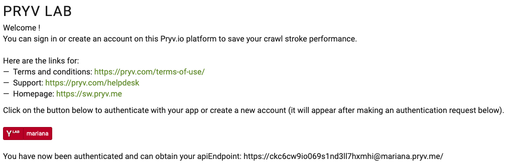
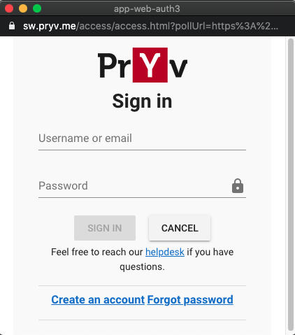

# Pryv.io onboarding

This example describes how to implement an onboarding experience for your users.

This example demonstrates how your application should initialize, allowing the developer to interactively perform the different steps to illustrate the process.

The main parts are the service information and the authentication request, which are exposed in the lower part of the interface and dynamically adapt the onboarding message. In a real life application, only the welcome part will be displayed to the user, while the service information and authentication request calls are done automatically.

## Service information

You will need to call service information URL which contains all the necessary information that your application requires to function.

References:

- https://api.pryv.com/reference/#service-info
- https://api.pryv.com/guides/app-guidelines/

Upon start, your app will retrieve this information, and use it to:

- customize the platform name and useful links: terms and conditions, support and homepage
- define the [URL where the app authentication call will be made](https://api.pryv.com/reference/#auth-request)

There are also several optional parameters that allow to define some [visual assets](https://github.com/pryv/assets-open-pryv.io). You can set these in the platform configuration:

- Open Pryv.io: https://github.com/pryv/open-pryv.io#options--customization
- Pryv.io: Fork [asset-pryv.me](https://github.com/pryv/assets-pryv.me)

## Application onboarding

As a Pryv.io account is meant to be accessed by specialized apps with well defined permissions sets depending on:

- visualized data
- data sources such as sensors
- algorithms

We recommend to onboard users through the app authentication process, described here: https://api.pryv.com/reference/#authenticate-your-app

Therefore, when boot, your app should initiate an [authentication request](https://api.pryv.com/reference/#auth-request) and present a view used for:

- app authentication
  - sign in
  - consent
- account creation
- password reset request

As your users could be onboarded from multiple entry points, such as multiple applications accessing data from a single platform, it is convenient to implement the aforementioned steps at a single place.

These are all implemented by our open source application [app-web-auth3](https://github.com/pryv/app-web-auth3). 
These views are implemented as "popups" that open during user account creation, signin, consent request from the app and password reset process.

## Play with the API

At the end of the process, you will have a Pryv.io API endpoint which allows you to save your users swimming practice.

To improve your stroke performance, you can use our [Postman collection](https://api.pryv.com/open-api/).

### Next steps

- [collecting survey data](collect-survey-data)
