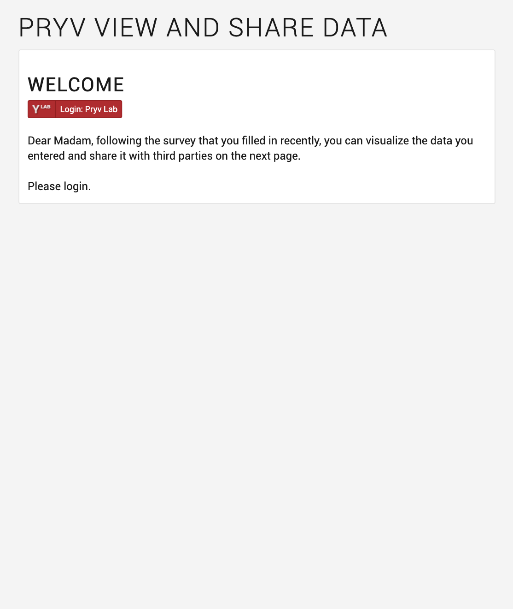
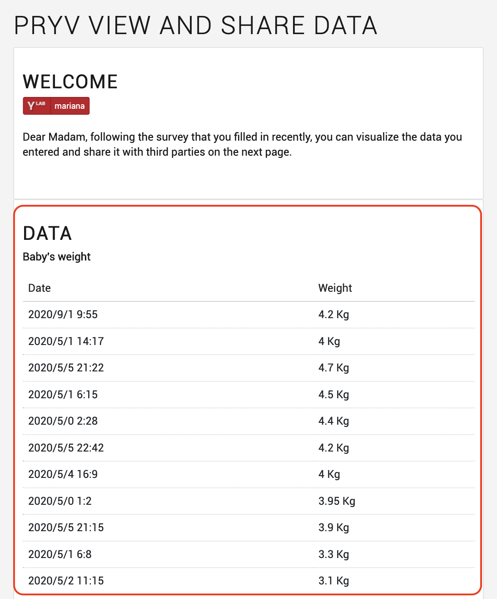
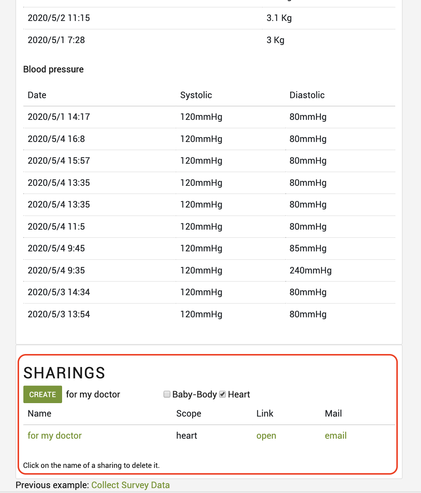

## Pryv view and share data example 

Web app for data visualization & sharing with third parties.

## Story

In the previous tutorial [Collect Survey Data](https://github.com/pryv/app-web-examples/tree/master/collect-survey-data), you have collected and stored data from the mother in her Pryv.io account when she answered the example survey.

In this web app, you provide her with a tool to visualize data from her account and to share it with third parties.

| Sign in                                                 | Visualize data                                                  | Share data                                                      |
| ------------------------------------------------------------ | ------------------------------------------------------------ | ------------------------------------------------------------ |
|  |  |  |

## Project Specifications

- Ask for login
- Request access for the app "pryv-example-view-and-share" to read the streams "Baby" and "Body"
- Display the data
- Create or delete a sharing (URL or email) to a third party
- Display shared data 

## Data structure

This use case implies the stream structure from the example "Collect Survey Data" as illustrated below.

The app "pryv-example-view-and-share" first requests an access on the streams "Baby" and "Body" with a "read" level in order to be able to display the events contained in these streams:

 

## Display data

Data from the streams "Baby-Body" and "Heart" is fetched by the app and displayed in a table form.
The weight of the baby and the blood pressure are presented along with the time and date of the measurement, that is converted from milliseconds to ISO 8601 format.

## Data sharing

Either one of the streams "Baby-Body" or "Heart", or both streams, can be shared with third-parties. The sharing consists in a link that can be communicated directly to the third party of the user's choice or by email.
When opened, it displays the data within the scope of the sharing.