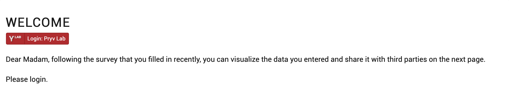
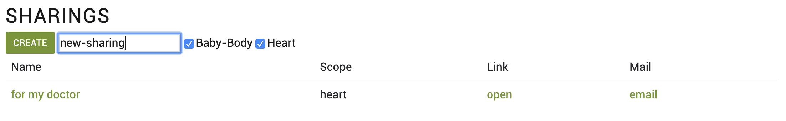

# Pryv View and share data tutorial

All you need to run this app is to download [index.html](index.html) and [script.js](script.js) files and open **index.html** with your browser.

This is a data visualization and sharing web app that first displays a welcome message and a button to initiate the authentication process.
<p align="center">

</p>


With a click on the login button, a popup opens in your browser where you can either authenticate or create a new account. 

When signed in, you can consent to give the app access to the streams "Body" and "Baby" where the data from the form (see ["Collect survey data"](collect-survey-data) example) is stored.
<p align="center">

</p>
Once you have accepted, it displays the saved data of your baby's weight and your own blood pressure.

You can choose to share this data by creating a new sharing at the bottom of the page. This will generate a URL link that contains the shared streams ("Baby-Body", "Heart" or both).

<p align="center">

</p>


## Customize the display of the data

The recorded data and the sharings are put into tabular form. You will find the code related to the data display in the [index.html](index.html) file. We invite you to customize it with your own message and headings, and adapt the data display according to your needs.

## Authenticate your app

For this application, we have used the [Pryv JavaScript library](https://github.com/pryv/lib-js), loading it for [the browser](https://github.com/pryv/lib-js#browser) as following:

```html
<script src="https://api.pryv.com/lib-js/pryv.js"></script>
```

For authentication, we will use the [Pryv.io consent process](https://github.com/pryv/lib-js#within-a-webpage-with-a-login-button) adding the following element in the HTML:

```html
<span id="pryv-button"></span>
```

The [auth request parameters](https://api.pryv.com/reference/#auth-request) and callback are defined in the separate [script.js](script.js) file:

```javascript
var connection = null;

var authSettings = {
  spanButtonID: 'pryv-button', 
  onStateChange: pryvAuthStateChange,
  authRequest: { 
    requestingAppId: 'pryv-example-view-and-share',
    languageCode: 'en', 
    requestedPermissions: [
      {
        streamId: 'body',
        defaultName: 'Body',
        level: 'read'
      },
      {
        streamId: 'baby',
        defaultName: 'Baby',
        level: 'read'
      }
    ],
    clientData: {
      'app-web-auth:description': {
        'type': 'note/txt',
        'content': 'This sample app demonstrates how you can visualize and share data with an app token.'
      }
    },
  }
};

function pryvAuthStateChange(state) {
  console.log('##pryvAuthStateChange', state);
  if (state.id === Pryv.Browser.AuthStates.AUTHORIZED) {
    connection = new Pryv.Connection(state.apiEndpoint);
    username = state.displayName; 
    showData();
  }
  if (state.id === Pryv.Browser.AuthStates.INITIALIZED) {
    connection = null;
    showLoginMessage();
  }
}

async function showData() {
  resetData();
  document.getElementById('please-login').style.visibility = 'hidden';
  document.getElementById('data-view').style.display = '';
  document.getElementById('data-view').style.visibility = 'visible';
  document.getElementById('sharing-view').style.display = '';
  document.getElementById('sharing-view').style.visibility = 'visible';
  await loadData();
}

function showLoginMessage() {
  resetData();
  document.getElementById('please-login').style.visibility = 'visible';
  document.getElementById('data-view').style.display = 'none';
  document.getElementById('data-view').style.visibility = 'hidden';
  document.getElementById('sharing-view').style.display = 'none';
  document.getElementById('sharing-view').style.visibility = 'hidden';
}
```

The root streams of the `requestedPermissions` array are created if they don't exist yet. They will already be populated with events data if you ran the [Collect survey data example](collect-survey-data) previously.

The auth request is done on page load, except when the shared data is loaded by a third-party:

```javascript
window.onload = async (event) => {
  // ...	
  service = await Pryv.Browser.setupAuth(authSettings, serviceInfoUrl);
};
```

## Load data

Once the user is signed in, data from his Pryv.io account is fetched. If there is no data, a warning is displayed to invite the user to fill in the form from the previous [example](collect-survey-data) on **Survey data collection**.

```javascript
async function loadData() {
  const result = await connection.api([{method: 'events.get', params: {limit: 40}}]);
  const events = result[0].events;
  if (! events || events.length === 0) {
    alert('There is no data to show. Use the Collect survey data example first');
    return;
  }
```
Data from both "Baby-Body" and "Heart" streams is presented in a tabular form:

```javascript
  const babyDataTable = document.getElementById('baby-weight-table');
  const heartDataTable = document.getElementById('blood-pressure-table');
  for (const event of events) {
    if (event.streamIds.includes('baby-body') && event.type === 'mass/kg') {
      addTableEvent(babyDataTable, event, [event.content + ' Kg']);
    }
    if (event.streamIds.includes('heart') && event.type === 'blood-pressure/mmhg-bpm') {
      addTableEvent(heartDataTable, event, 
        [event.content.systolic + 'mmHg', event.content.diastolic + 'mmHg']);
    }
  }
	if (apiEndpoint == null)
    updateSharings();
}
```
The sharings of the user are also displayed using the function **updateSharings()** that performs a [get.accesses](https://api.pryv.com/reference/#get-accesses) API call:

```javascript
async function updateSharings() {
  const result = await connection.api([{ method: 'accesses.get', params: {}}]);
  const sharingTable = document.getElementById('sharings-table');
  const accesses = result[0].accesses;
  if (! accesses || accesses.length === 0) {
    return;
  }
  resetTable('sharings-table');
  for (const access of accesses) {
    await addListAccess(sharingTable, access);
  }
}
```

## Create a sharing

In order to create a sharing, we add a listener to the *Create* button:

```javascript
window.onload = (event) => {
  document.getElementById('create-sharing').addEventListener("click", createSharing);
  // ...
};
```

This will fetch values for the scope of the sharing ('streamId' for permissions):

```javascript
const checkBaby = document.getElementById('check-baby').checked;
const checkBP = document.getElementById('check-bp').checked;
const permissions = [];
  if (checkBaby) permissions.push({streamId: 'baby-body', level: 'read'});
  if (checkBP) permissions.push({ streamId: 'heart', level: 'read' });
```

It will package those values into an [accesses.create](https://api.pryv.com/reference/#create-access) API call.

```javascript
  const res = await connection.api([
    { 
      method: 'accesses.create', 
      params: {
        name: name,
        permissions: permissions
      }
  }]);
  updateSharings();
}
```

This call is made using [Connection.api()](https://github.com/pryv/lib-js#api-calls) method.

In the same way, the function **deleteSharing()** enables to delete the selected access by the user by performing an [accesses.delete](https://api.pryv.com/reference/#delete-access) API call.

```javascript

async function deleteSharing(accessId) {
  if (! confirm('delete?')) return;
  await connection.api([
    {
      method: 'accesses.delete', 
      params: {
        id: accessId}
    }
  ]);
  updateSharings();
}
```

## App guidelines

### Custom service info

Following our [app guidelines](https://api.pryv.com/guides/app-guidelines/), we build apps that can work for multiple Pryv.io platforms providing a `serviceInfoUrl` query parameter:

```javascript
const serviceInfoUrl = Pryv.Browser.serviceInfoFromUrl() || 'https://reg.pryv.me/service/info';
```
To set a custom Pryv.io platform, provide the service information URL as shown here for the Pryv Lab:

[https://api.pryv.com/app-web-examples/view-and-share/?pryvServiceInfoUrl="https://reg.pryv.me/service/info"](https://api.pryv.com/app-web-examples/view-and-share/?pryvServiceInfoUrl=%22https://reg.pryv.me/service/info%22)

 To launch this app on your [local Open Pryv.io platform](https://github.com/pryv/open-pryv.io#development) use (the link requires to have a running Open Pryv.io with the rec-la SSL proxy):

[https://api.pryv.com/app-web-examples/view-and-share/?pryvServiceInfoUrl="https://my-computer.rec.la:4443/reg/service/info"](https://api.pryv.com/app-web-examples/view-and-share/?pryvServiceInfoUrl=%22https://my-computer.rec.la:4443/reg/service/info%22). 

### Authenticated API endpoint

You can also load the app already authenticated, by providing the `pryvApiEndpoint` query parameter. For example:

[https://api.pryv.com/app-web-examples/view-and-share/?pryvApiEndpoint=https://ckbry9n6h009o1od3qiv3qz7u@mariana.pryv.me/](https://api.pryv.com/app-web-examples/view-and-share/?pryvApiEndpoint=https://ckbry9n6h009o1od3qiv3qz7u@mariana.pryv.me/)

```javascript
window.onload = async (event) => {
  if (apiEndpoint != null) {
    document.getElementById('welcome-message-mme').style.visibility = 'hidden';
    connection = new Pryv.Connection(apiEndpoint);
    document.getElementById('username').innerText = apiEndpoint.split('@')[1].slice(0,-1);
    showData();  
  }
  // ...
};
```

